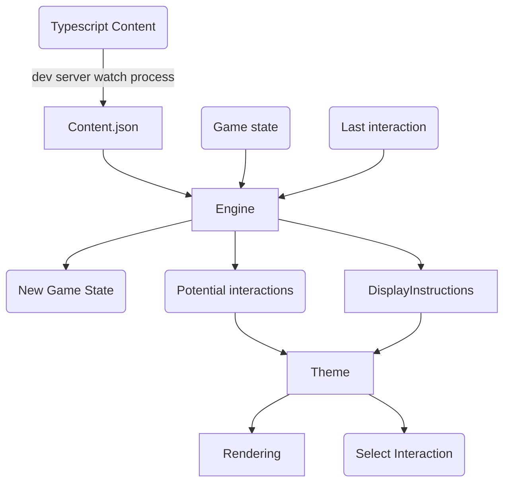

# Architecture of Point 'n Click

# Goals of the engine

1. Easy writing of game content
2. Able to start out as text adventure, and make it grow to a graphical adventure
3. Build as you run it, for easy testing
4. Multilingual
5. Deploy as a PWA for local installation and offline play

## Easy writing of game content

To make writing of content easier (and with less bugs). TypeScript is used as a DSL to define the game state, and help with auto completion of writing content. The content you write is **not** the code that gets executed, that's why an `if` statement does not work.

The code you write is merely a helper to write content, and gets translated to a single `contents.json` in the `.point-n-cache` folder of the source game.

This means that in the future, if the time investment allows it, a dedicated editor or language could be made and still output that same `contents.json`.

This contents file is what gets processed in the game engine.

## Starting out as a text adventure

Creating a game is a lot of work. To make a quick setup using text only saves time in trying to see if your adventure and puzzles work. You describe a scenery in words instead of making elaborate drawings for them.

To make this possible, the game uses 3 elements: The game content, the game state, and the user interaction.

The game uses the last interaction as starting point (after it was chosen, before it was executed). And is therefor able to render and rerender the current screen during development changes. The content triggers new state changes, or collects new 'display instructions'.

The display instructions are then processed by each individual 'Theme' Some themes don't understand all instructions. For instance, a terminal client is not able to process image or audio data.

This mechanic you can also use to describe some things in text that later gets ignored in a graphical version, because the text would describe what the user is already able to see.

This means the content and state is Theme agnostic, and can be used in all versions of the game. (And allows you to play in browser and terminal in synchronized fashion)

## Build as you run it

Because the engine stores the latest chosen interaction before execution, and all the content is merely a `.json` file. The engine can load in the new content, and start playing again with the latest interaction, live updating the screen you are looking at.

# Multilingual

Because the content can be fully executed directly (since it only collects content). the dev server can directly extract all text and produce a text file for a different language than the source language. And since you can specify in which language you want to play the engine can start a watch process to auto update translation changes as well.
