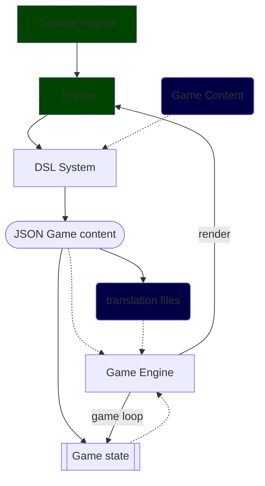
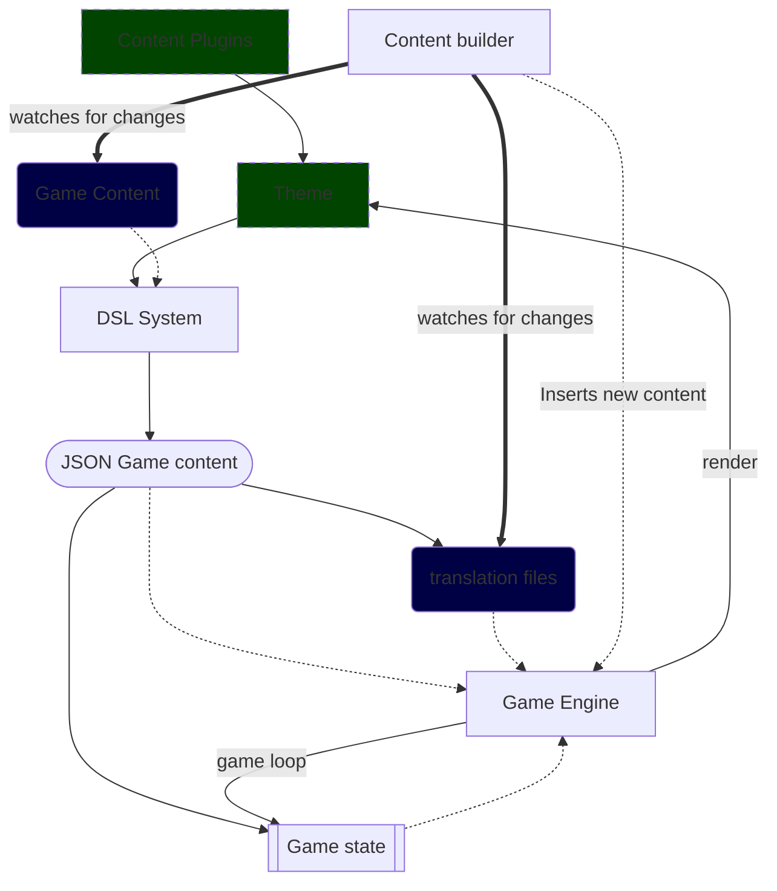

# Architecture

Short reasoning about different parts

```mermaid
flowchart TD
  classDef plugin fill:#040,stroke-dasharray: 5 5
  classDef content fill:#004

  contentPlugins[Content Plugins] --> theme
  class contentPlugins plugin

  theme[Theme] --> dsl
  class theme plugin

  content(Game Content) -.-> dsl[DSL System]
  class content content

  dsl --> json([JSON Game content])
  json --> tl(translation files) & st[[ Game state]]
  class tl content

  json & tl & st -.-> eng[Game Engine]

  eng -- game loop --> st
  eng -- render --> theme

```

# Development mode

```mermaid
flowchart TD
  classDef plugin fill:#040,stroke-dasharray: 5 5
  classDef content fill:#004

  contentPlugins[Content Plugins] --> theme
  class contentPlugins plugin

  theme[Theme] --> dsl
  class theme plugin
  content(Game Content) -.-> dsl[DSL System]
  class content content

  dsl --> json([JSON Game content])
  json --> tl(translation files) & st[[ Game state]]

  json & tl & st -.-> eng[Game Engine]
  class tl content

  eng -- game loop --> st

  cb[Content builder]

  cb == watches for changes ==> content
  cb == watches for changes ==> tl
  cb -. Inserts new content .-> eng
  eng -- render --> theme

```
